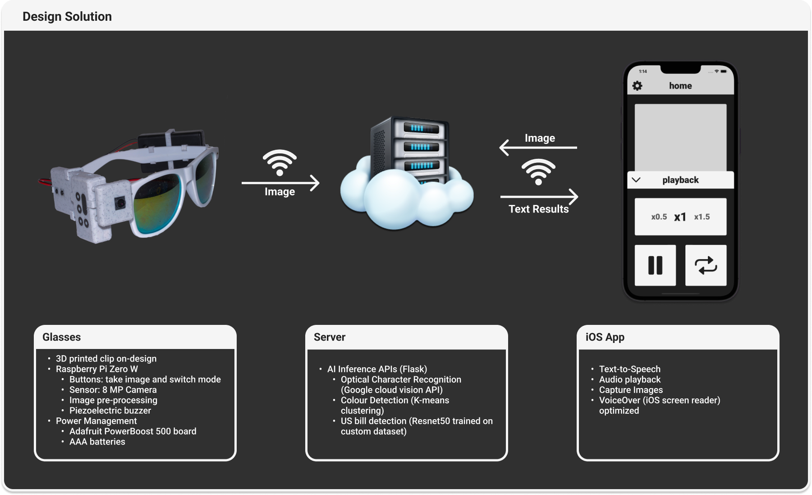

# Vizia

[Promotional Video](https://www.youtube.com/watch?v=aw0gHmt1xBc)

There are roughly 253 million people globally who have some form of visual impairment. Sighted individuals take for granted the richness of visual information available to them in order to navigate the world. We have developed wearable glasses that can extract, decode, and communicate information from an image to a visually impaired user through audio transcription. Our system leverages computer vision to perform optical character recognition, money classification, and colour detection.

